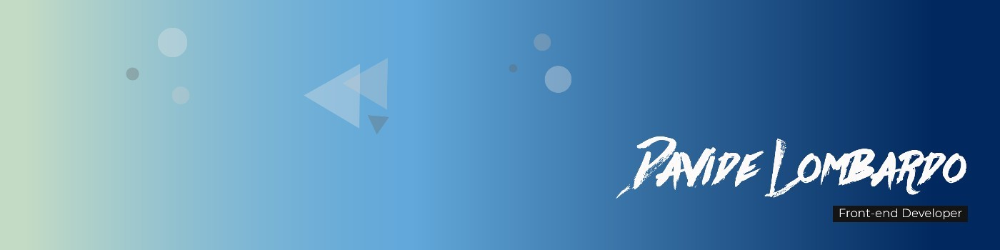

    

<h1 align="center">Hi My name is Davide</h1>
<h3 align="center">Frontend dev that love building beautiful, fast and responsive web applications</h3>
  

## Some other info about me

<samp>
    <ul>
        <ul>
            <li>I like to code in 
                <strong>JavaScript</strong>, 
                <strong>TypeScript</strong>, and 
                <strong>CSS</strong>
            </li>
            <li>I'm working mostly with 
                <a href="https://angular.dev/">Angular</a>
            </li>
        </ul>
    </ul>
</samp>
 

## What I'm planning to study?

<samp>
     <ul>
        <ul>
        <li>Node</li>
        <li>Express</li>
        <li>MongoDB</li>
       </ul>
    </ul>
</samp>
 

##  Languages 🔧

  
  
  
  
  

 

## Framework and Libraries 💻 

  
  
  
   

 

## Most used Languages 📊

 

### Connect with me on Linkedin 📫

 

